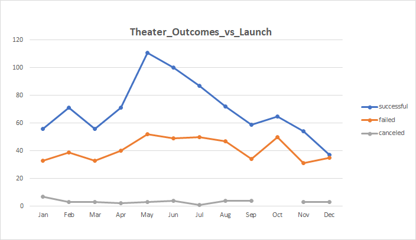
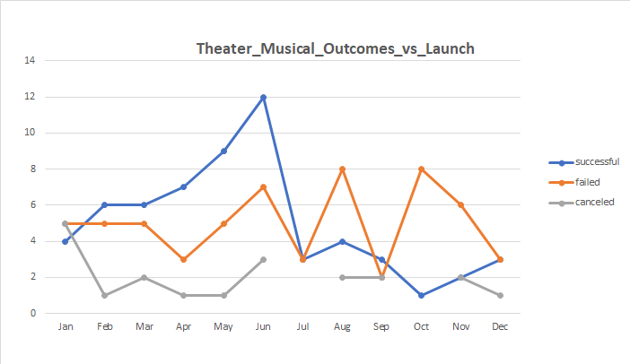
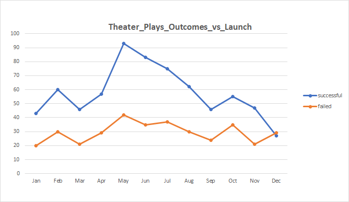
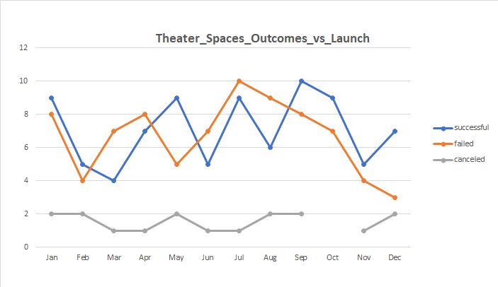
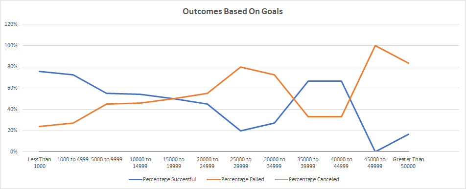
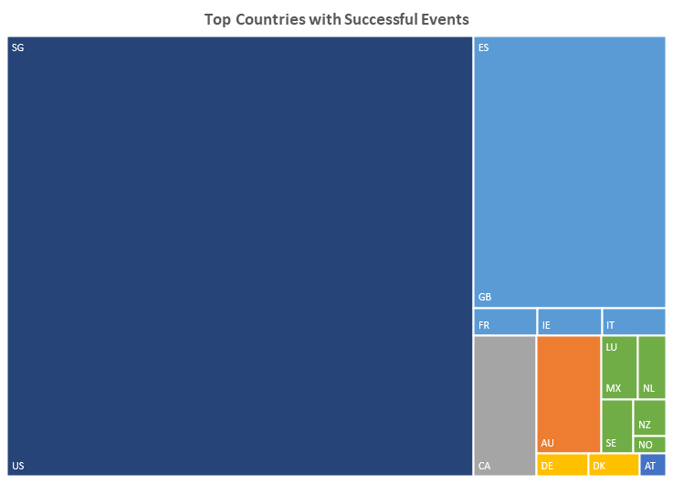
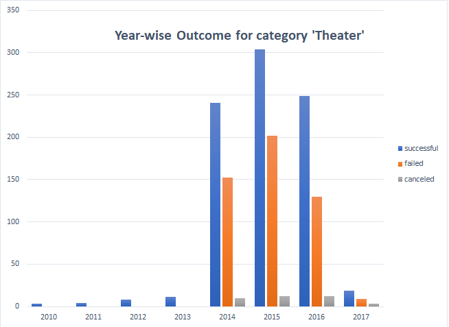

# **Kickstarting with Excel**

## **Overview of Project**
The purpose of the project is to analyse the provided data set for several thousand crowdfunding projects to uncover any hidden trends. We have researched the campaign outcomes, specially for category 'Theater' based on their launch dates and goals to create visualizations like summary tables and charts to understand data trends for generating business insights and forecasting outcomes. 

## **Analysis and Challenges**
### **Analysis of Outcomes Based on Launch Date**
#### Outcomes based on launch date for 'Theater' 

#### Outcomes based on launch date for 'Theater' sub-categories 'Musical', 'Plays' and 'Spaces' respectively.

* The Kickstart campaigns for 'Theater' were most successful in May post which the number for successful campaigns started to come down.
* December seemed to be the worst month for successful campaigns.
* Based on sub-category, December wasn't a bad month for 'Spaces' as against 'Play' and 'Musicals'.
* While the number for failed campaigns was way lower than the number for successful ones through all months, December again did not do well. It had almost same number of failed and successful campaigs.

### **Analysis of Outcomes based on goals chart**

* The percentage of successful projects was highest for projects with budget lesser than $5000.
* The percentage of successful projects was least for projects with budget $25000-$35000 and greater than $45000.
* No campaings were canceled in this category of 'Theater'.

### **Challenges**
* A number of columns in the data sheet created confusion. So the required columns to be worked with were highlighted for convinience and readability. Also conditional formating was applied to the 'Outcome' for better readability.
* The Launch date needed to be converted to a readable format before performing analysis and for reports for the benefit of business folks and stakeholders.
* #DIV/0! error was noticed while creating a new column (Percentage Successful in Outcomes Based on Goals sheet) and applying a formula to it. It was adressed by using IFERROR() formula, which catches errors and  replaces them with a user-defined input (0 in our case).

## **Results**
### **Two conclusions- Outcomes based on Launch Date**
* April to August are the best months for conducting campaigns for 'Theater', May being the best.
* Although December is not a good month for most 'Theater' Projects, it wasn't a bad month for 'Spaces'. Thus more of 'Spaces' projets can be undertaken in December rather than 'Musicals' and 'Play'.

### **Conclusions- Outcomes based on Goals**
* Out of the total of 1043 Theater projects, 694 were successful which is a 67%. So Kickstart campaign is a good idea with some thoughtful setting of goals. For instance, having more projects with smaller goals upto $5000 is a good idea. Having said that, a few projects with higher goal can be considered based on surety to avoid huge loss in case of failure. Also for large goal projects, there can be an optimum time to continue the project. For instance, carry on the project for at least a month to give it a fair time to succeed; but not more than 40 days, so it can be aborted once one is sure its not working which would save some budget there.  
* Unlike a lot of other categories, fotunately no campaings were canceled which is another reason campaigns are a good idea for this category.

### **Limitations of this dataset**
* It was unclear how was the 'outcome' value was arrived at, based on goal and pledged value. It could have helped calculate the revised goal for future projects based on past outcome.
* We couldnt figure out the significance of 'staff pick' and 'spotlight' columns.
* More data showing details on other factors effecting campaign would have given more clear picture on the reason of outcome, like representatives, age of target audiences, popular events of the country etc.

### **Some other possible tables and/or graphs that we could create**
* Bar Chart showing Country wise Outcome. US, BD, CA are the 3 most significant countries where most projects were happened. Others can be ignored or grouped as one for convinience.

* Year-wise outcome for 'Theater'. 2014, 2015 and 2016 have been the most significant years when most projects were happened. 

